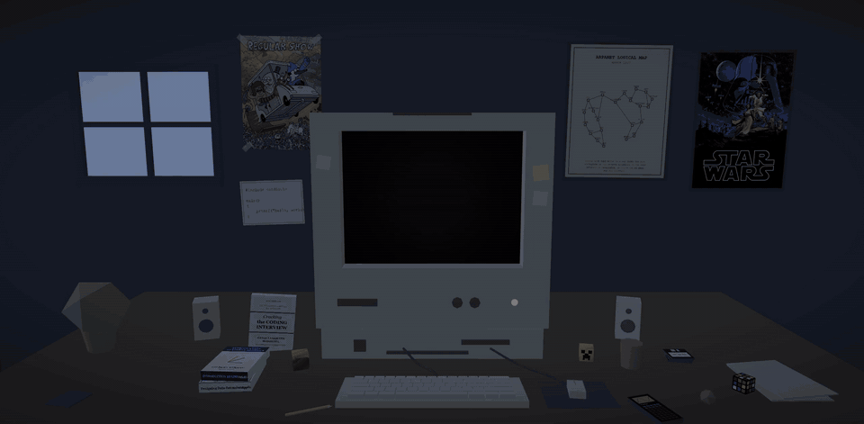

# gabeshores.com

My personal portfolio. It opens in a low poly room with a CRT on the desk, then the camera dives through the glass and the site boots up.

[](https://gabeshores.com)

### [Visit gabeshores.com](https://gabeshores.com)

## Built with

Plain HTML, Tailwind CSS and three.js. No framework, no build step beyond the CSS.

## Run it locally

```bash
npm install
npm start
```
